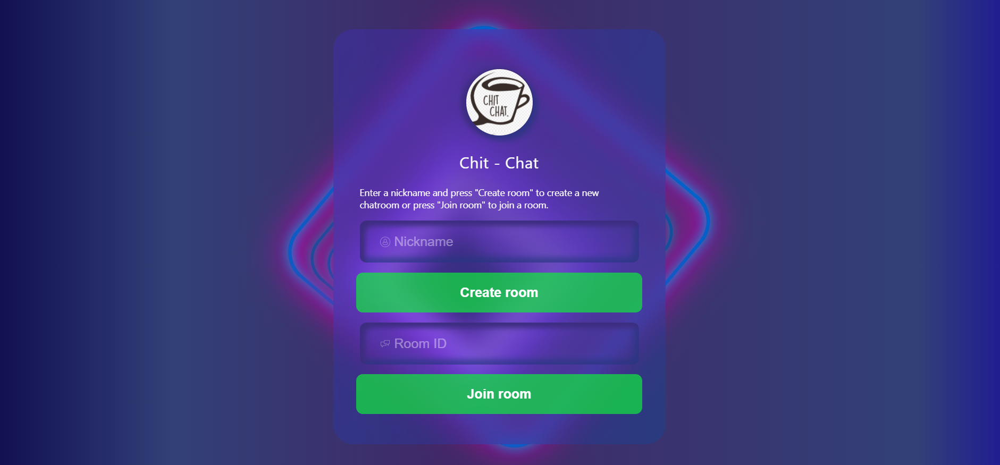

# Chit-Chat

This is the frontend of a chat application.

## Table Of Contents

- [Demo](#demo)
- [Getting Started](#getting-started)
  - [Prerequisites](#Prerequisites)
  - [Installation](#installation)
- [About the project](#about-the-project)
- [Technologies](#technologies)
- [Usage](#usage)
- [Roadmap](#roadmap)

## Demo



## Getting Started

If you do not wish to download any file, you can visit https://davidguere.github.io/Chit-Chat/ to check the website.

### Prerequisites

To run the project you will need Node installed on your computer.

### Installation

- Save or clone the repository from https://github.com/DavidGuere/Chit-Chat.

  - To save the zip file click on the "Code" button and then on "Download ZIP"
  - To clone the repository open the terminal in your desired directory and run the `git clone` command:
    ```sh
    git clone https://github.com/DavidGuere/Chit-Chat.git
    ```

- Run the following code to install the necessary modules:
  ```sh
  npm install
  ```
- Run the `npm` command to run the project locally on your computer in development mode:

  ```
  npm start
  ```

## About the project

This web application is the frontend of a future project. The chat application is designed using an MVC design pattern and a glass UI design.

## Technologies

- JavaScript: A high-level programming language.
- React: An open-source, front end, JavaScript library for building user interfaces or UI components.
- HTML: Hypertext Markup Language is the standard markup language for documents designed to be displayed in a web browser.
- CSS: A style sheet language used for describing the presentation of a document written in HTML.

- TypeScript: A strict syntactical superset of JavaScript.

## Usage

To use the application simply enter a nickname for the new user and click on "Create room" to create a new room. You will automatically be forwarded to the chatroom.

## Roadmap

The page is only a frontend app. In the future the app will also have a backend to make it possible to chat with other people online. The main object of this project is to use new technologies such as TypeScript and Docker.

The backend will be build using Java and Docker.
